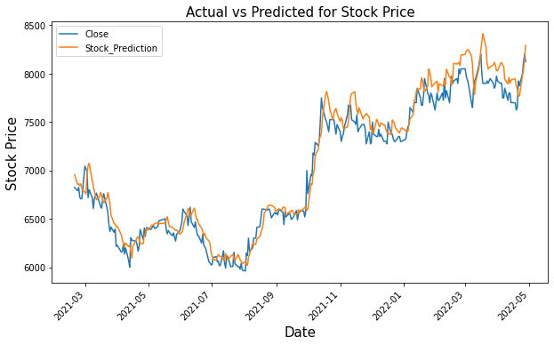

# My Data Science & Machine Learning Projects

---

## PCA-LSTM for Stock Prediction

The prediction of stock market fluctuations has long been a crucial area of research in the financial field. Traditional analysis methods often struggle to reveal the hidden information behind these fluctuations, leading to a reduction in prediction accuracy. In this project, I implemented the Principal Component Analysis (PCA) method to reduce the dimensionality of the data, and combined it with Long Short-Term Memory (LSTM) to predict stock prices. The results showed that using PCA-LSTM yielded higher prediction accuracy than using LSTM alone.

   

[View code on Google Colab](https://colab.research.google.com/drive/1pzRANCBMQa0uu_uG4OilKxz0r3lnrosU?usp=sharing#scrollTo=q6kVgwmxx8vM)

---

## Cost & Delivery Time Prediction

Managing a high-performance supply chain requires a precise understanding of the time and cost required for product delivery. Accurately predicting delivery time and cost by analyzing historical data (time series) is crucial. In this project, I developed delivery time prediction using various machine learning models and selected the best model for prediction. Additionally, I developed cost of delivery prediction using LightGBM models, which yielded the best results for cost prediction.

  

[View code on Google Colab](https://colab.research.google.com/drive/1dQs6cRTT2pEoLFd2IoDC5zj6CLjEmhsn#scrollTo=XUJD0gXnFfDJ)

<!-- ## Skin Cancer Segmentation

Skin cancer segmentation is a critical task in the diagnosis and treatment of skin cancer. In this project, I developed an automated method for accurately segmenting skin cancer images. Using the functional API in TensorFlow, I built a U-Net architecture model that effectively segmented the affected areas of skin. To evaluate the model's performance, I used the Intersection over Union (IoU) metric and the Dice coefficient, achieving impressive results that indicate the model's ability to accurately identify and segment skin cancer.

  

[View code on GitHub repository](https://github.com/rfajri27/skin-cancer-segmentation)

--- -->

